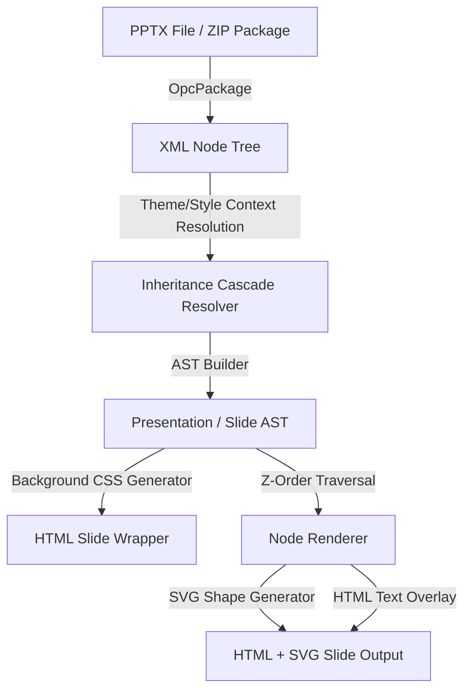

# Architectural Overview

This document provides a detailed overview of the architecture of `pptx-renderer-rust`, covering its design principles, parsing pipeline, rendering model, and style inheritance hierarchy.

---

## High-Level Architecture

The library is split into two primary pipelines: the **Parsing Pipeline** and the **Rendering Pipeline**. These operate on a shared data model defined in `src/model.rs`.



---

## 1. The Parsing Pipeline

PowerPoint files (.pptx) are Open Packaging Conventions (OPC) ZIP archives containing XML parts and media assets. The parser loads and builds a structured Abstract Syntax Tree (AST) of the presentation.

### Step 1: Package Opening & Directory Mapping
The parser uses `OpcPackage` to read individual ZIP streams. It locates the entrypoint `ppt/presentation.xml` and reads its relationships from `ppt/_rels/presentation.xml.rels` to map presentation slide IDs to their physical target XML paths (e.g., `ppt/slides/slide1.xml`).

### Step 2: Inheritance & Context Discovery
For each slide target, the parser resolves relationships to find:
- **Slide Layout** (e.g., `ppt/slideLayouts/slideLayout1.xml`)
- **Slide Master** (e.g., `ppt/slideMasters/slideMaster1.xml`)
- **Theme** (e.g., `ppt/notesMasters/theme/theme1.xml` or similar theme paths)

These relationships are gathered into a `StyleContext` containing references to the theme data, master text styles, and layout/master placeholders.

### Step 3: XML Parsing with `XmlNode`
Since PPTX utilizes standard XML namespaces, the library parses XML using a lightweight, custom, stack-based parser wrapper (`XmlNode`) built over `quick-xml`. `XmlNode` abstracts away tag namespaces (e.g., matching `p:sp` or `a:t` as generic tags) and simplifies attribute extraction.

### Step 4: Building the AST (`Presentation` Struct)
The parser walks each slide node tree and parses individual shapes, groups, pictures, and tables into the strongly-typed AST:
- **Positions & Sizes**: Converts native PowerPoint units (EMUs - English Metric Units) into points or pixels by dividing by `9525.0`.
- **Text Bodies**: Collects paragraphs, indentation levels, bullets, runs, and character formatting.
- **Embedded Images**: Reads zip entries for embedded pictures, converts them to base64 Data URIs, and embeds them directly into the slide nodes (`blip_embed` field).

---

## 2. The Style & Text Inheritance Cascade

One of the most complex tasks when parsing PPTX files is resolving styling properties (colors, fonts, margins, alignments). The PPTX format relies heavily on a hierarchical fallback model. If a styling attribute is not defined on a specific text run, the engine checks parent structures in a specific order:

```
[1. Individual Text Run (rPr)]
           │
           ▼
[2. Paragraph Properties (pPr)]
           │
           ▼
[3. Shape List Style (lstStyle)]
           │
           ▼
[4. Slide Layout Placeholder lstStyle]
           │
           ▼
[5. Slide Master Placeholder lstStyle]
           │
           ▼
[6. Slide Master Text Styles (Category Default)]
           │
           ▼
[7. Theme Default (Major/Minor Fonts)]
```

### Context Resolution API
During parsing, `StyleContext<'a>` is passed down to all node-parsing functions:
- **Placeholder Matching**: If a shape is a placeholder (e.g., a Title or Body placeholder), the parser matches it with the corresponding placeholder in the Slide Layout or Slide Master by its `type` or index (`idx`). It then pulls dimensions, offsets, and properties from the layout/master template.
- **Theme Mapping**: Font families like `+mj-lt` (major font) and `+mn-lt` (minor font) are resolved to their concrete typeface names (e.g., `Carlito`, `Arimo`, `Tinos`) using the current Theme data.
- **Color Schemes**: Scheme colors (e.g., `accent1`, `dk1`, `bg1`) are looked up against the theme color map or standard fallbacks.

---

## 3. The Rendering Pipeline

The rendering pipeline converts the strongly-typed `Presentation` AST into a self-contained, CSS-styled HTML fragment.

### Step 1: Slide Canvas Wrapper
`render_slide` generates a root `<div>` styled with absolute dimensions (`width` and `height` parsed from the presentation size) and the background style:
- **Backgrounds**: Resolved via `render_background` into a CSS style string, supporting solid colors, linear gradients, cover images, and tiled images.

### Step 2: Layered Z-Order Traversal
To preserve visual layering, nodes are rendered in order of definition, traversing three layers:
1. **Master Nodes**: Background decorations and footers defined on the Slide Master.
2. **Layout Nodes**: Structural nodes defined on the Slide Layout.
3. **Slide Nodes**: Concrete content nodes defined directly on the slide.

### Step 3: Node-Specific Renderers
Each node is rendered based on its type:
- **Groups (`group`)**: Rendered as a container `<div>` with `transform: scale(x, y)` to dynamically scale all child nodes based on group bounds and offsets.
- **Pictures (`picture`)**: Rendered as `` tags referencing base64 Data URIs.
- **Tables (`table`)**: Rendered as an SVG canvas drawing cell borders and fills, overlaid with HTML container `<div>` blocks displaying cell texts.
- **Shapes (`shape`)**: 
  - **Geometry**: Rendered as a vector `<svg>` tag. Path commands are computed based on the preset geometry name (e.g., `rect`, `ellipse`, `triangle`) and adjustment parameters in `shapes_presets.rs`.
  - **Borders & Fills**: Gradient fills are converted into SVG `<linearGradient>` definitions, while solid fills and line borders are mapped to SVG fill/stroke properties.
  - **Text Overlays**: Absolute layout boxes placed over the shape container, aligned vertically and horizontally based on paragraph settings.

---

## 4. Key Design Decisions

### Why inline SVG for shapes?
Instead of generating complex native HTML/CSS borders and clip paths, `pptx-renderer-rust` renders shape geometry using SVGs with absolute positioning. This ensures high-fidelity shape drawing (ellipses, callouts, arrows, etc.) while allowing text to be layered cleanly on top using HTML flexbox.

### Why Base64 Data URIs?
By embedding picture assets directly into the AST and rendered HTML as base64 data, the library outputs completely self-contained HTML pages. The output requires no external files or file-system dependencies, making it trivial to display in web browsers or pass directly to headless renderers.
